# CY300 OpenGL Engine

A small 3D engine and scene editor written in Python on top of OpenGL 4.5,
built as a CY300 course project. It renders with physically based materials,
cascaded shadows and image-based lighting, streams an Earth-sized procedural
planet under a physically based atmosphere, and comes with an ImGui editor for
building and saving scenes.

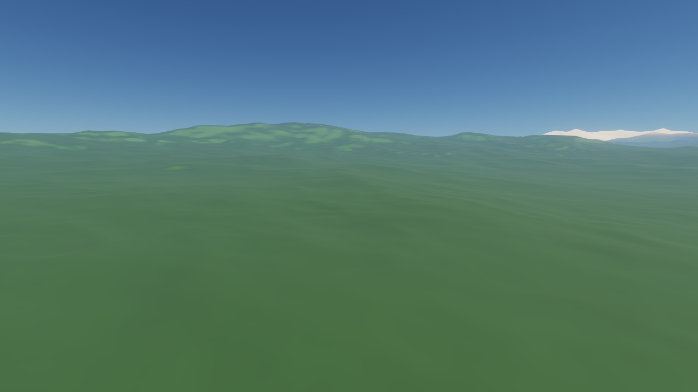

## Features

**Procedural planet**

- Earth-sized cube-sphere planet: continents and ocean basins from the plate
  simulation (or seeded noise without it), ridged mountain ranges, hills,
  and biomes, snow and sea ice from the climate model
- Quadtree level of detail per cube face with horizon culling; chunks are built
  on worker threads and streamed in coarse-to-fine without holes or cracks
- Planet-aware camera: radial "up", altitude-scaled flying speed, stays above
  the terrain
- Terrain parameters editable live in the inspector (the planet rebuilds)

**Bodies of the solar system**

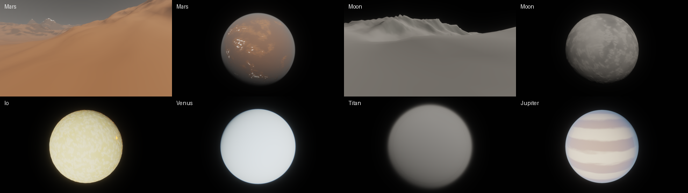

- Body profiles (`assets/bodies/*.json`, real data from NASA's fact sheets) for
  Mercury, Venus, Earth, the Moon, Mars, Jupiter, Io, Europa, Ganymede,
  Callisto, Saturn, Enceladus, Titan, Uranus, Neptune, Triton and Pluto:
  size, mass, rotation, tilt, orbit, star, temperature, surface liquid and
  colors, terrain relief, atmosphere (pressure, gases, aerosols), geology
- Physics derived from them: surface gravity, sunlight, equilibrium and
  greenhouse temperature, atmospheric scale height (H = RT / Mg), lapse rate
  (g / cp, less in moist or thin air), light scattering from pressure and gas
  mix, colored dust and haze, the star's color from its temperature, the
  sun's apparent size and (compressed) brightness
- Liquids and ices from phase physics (triple and critical points, vapor
  pressure curves): seas of water or methane freeze where colder than their
  freezing point and boil away (leaving dry basins) when hotter than their
  boiling point at the surface pressure; no liquid at all below the triple
  point (water on Mars). Ice caps of water, carbon dioxide, nitrogen or
  methane form below the frost point set by the gas's partial pressure
  (Mars's water-ice caps at ~-76 C, Pluto's and Triton's nitrogen ice).
  Life is a switch: without it, the same climate zones are bare ground
- File > New Planet builds any of them; Planet panel > Body shows its facts
  and turns the planet into another body (undoable)
- Dry worlds keep their basins, methane seas (Titan), glowing lava lakes
  (Io), mineral surface palettes, gas-giant cloud bands, and a black sky with
  hard shadows where there is no air
- Add a body by writing a new profile file; the loader validates it

**Plate tectonics**

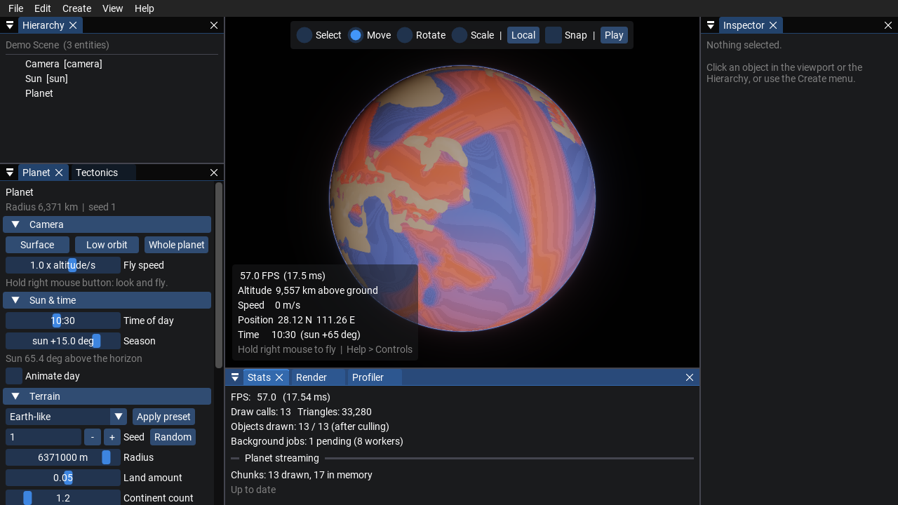

- A plate simulation on a global cube-sphere grid (~98,000 cells, ~80 km
  apart) shapes the continents: rigid plates rotate about their own poles at a
  few cm per year, 5 million years per step
- Where plates pull apart, new ocean floor forms at mid-ocean ridges and
  deepens as it ages; where they converge, the denser crust sinks: island
  arcs, Andes-style ranges (ocean under continent) and Himalaya-style ranges
  (continent-continent collisions)
- Erosion wears mountains down; colliding continents weld into one plate and
  large plates rift apart again, opening new oceans (a Wilson cycle)
- Runs in the background while you watch (Tectonics panel: play, pause,
  step, reset, speed); the terrain rebuilds from each new state without
  popping
- Data views: plates, crust age (with magnetic-stripe bands), continental /
  oceanic crust, converging / spreading boundaries
- Deterministic: a saved scene stores the seed and simulated time and
  re-simulates to the same planet on load

**Tectonic regimes**

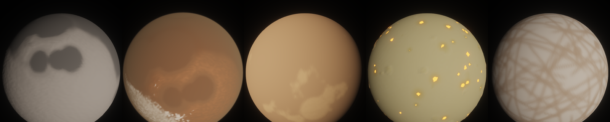

- Plate tectonics is one of five regimes, each its own simulation on the same
  grid (the terrain, data views and Tectonics panel work with all of them):
  - **Stagnant lid** (Mars, Mercury, the Moon): one rigid shell with
    ancient relief: a crustal dichotomy, giant impact basins, volcanic
    provinces over mantle plumes, lowlands flooded by dark lava (the maria);
    volcanism fades as the planet cools
  - **Episodic resurfacing** (Venus): lava floods nearly the whole surface
    every 400-800 Myr; only high tesserae plateaus survive, and rifts,
    volcanic rises and coronae form in between
  - **Heat-pipe volcanism** (Io): constant eruptions keep the surface a few
    Myr old: sulfur plains, glowing lava lakes in calderas that open and
    fill, tall mountain blocks that rise and slump
  - **Ice shell** (Europa, Ganymede, Triton): tidal cracks become wandering
    dark ridges and spreading bands, with chaos terrain, on young, low-relief
    ice
- Relief scales with gravity; the mineral palette colors each regime's crust
  (dark maria and lava, bright highlands and ice)

**Impact craters**

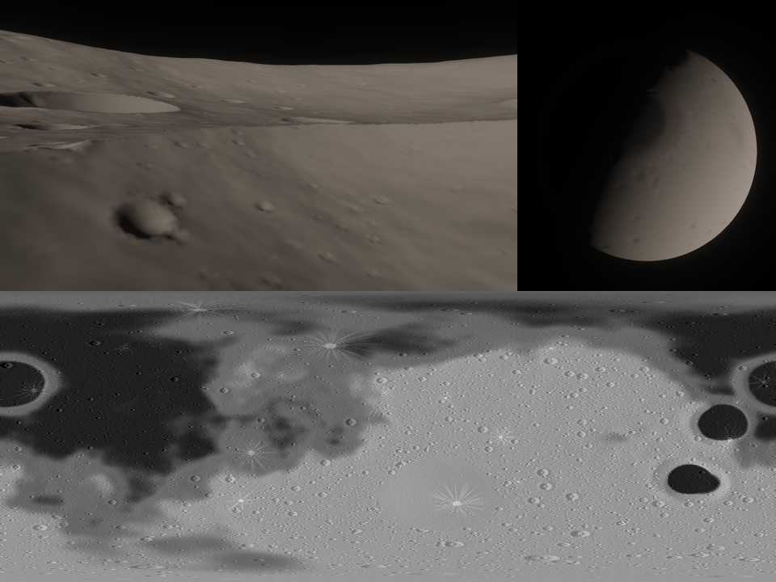

- Craters at every size from ~150 km down to tens of meters, evaluated per
  vertex like noise (a seamless 3D lattice per size octave), so they appear
  at any level of detail
- A realistic size mix (N(>D) ~ D^-2) and a count that follows the surface's
  age from its tectonic regime, by the lunar cratering chronology with its
  heavy bombardment: saturated lunar highlands, sparser maria, nearly blank
  Io and Europa
- Simple bowls below a transition diameter that shrinks with gravity (Moon
  ~15 km, Mars ~7 km), flat-floored complex craters with central peaks
  above; raised rims, ejecta blankets, older craters worn shallower
- Air burns up small impactors (Venus: nothing under ~3 km); rain and
  methane weather erase old craters (Earth, Titan)
- Young craters on airless bodies throw bright, lopsided ejecta rays
- Each body has its own seed (its own basins, maria and craters)

**Volcanoes**

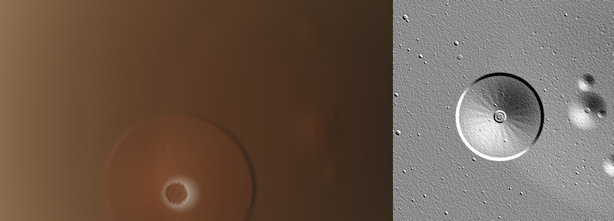

- Built where the tectonic simulation brings magma up: shield volcanoes over
  mantle plumes and hot spots (Olympus Mons, Mauna Loa, Maat Mons) with
  summit calderas, radial lava-flow ridges and, on the giants, a basal
  cliff; stratovolcano chains above subduction zones; fields of small
  shields on volcanic plains (Venus)
- Gravity sets the ceiling: the tallest scale with 1/g (Earth ~10 km, Venus
  ~11 km, Mars ~26 km)
- Only bodies that sustain plumes build large edifices (Earth, Venus, Mars,
  Io's low shields); the Moon and Mercury get small domes, icy moons none
- Evaluated per sample on the same seamless lattice as craters (each
  volcano exists if the ground at its center is volcanic), so they appear
  at every level of detail; summits are cold enough for snow and frost

**Erosion: rivers, glaciers and dunes**

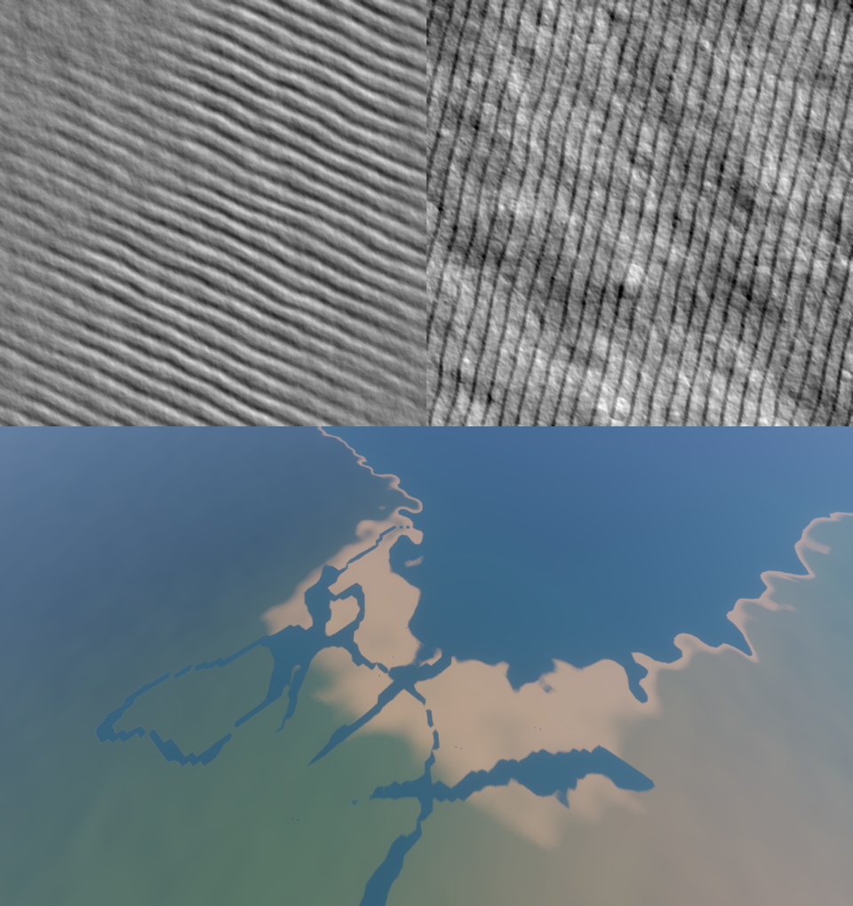

- Rivers from the climate's rain: a priority flood routes every land cell
  to the sea and fills depressions into lakes; discharge adds up downstream,
  and the largest flows become rivers as wide as their water, smoothed and
  meandering, in valleys carved down to their water level
- Deltas fan out into the sea at the biggest mouths, with distributary
  channels; where it is frozen, rivers become glaciers in wider U-shaped
  valleys
- Matched to the body: water on Earth, methane on Titan, none on dry or
  boiled-away worlds
- Wind-blown dunes where air can move sand and the ground is dry:
  transverse crests with steep slip faces across the wind (Earth's deserts,
  Mars's dark basaltic fields), long linear ridges along it in Titan's
  equatorial belt of dark organic sand; active dunes bury the craters under
  them
- Climate panel: river, glacier, lake and delta counts

**Climate and biomes**

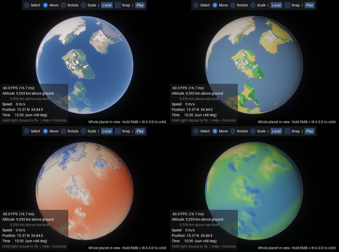

- Annual-mean climate from an energy balance (~0.5 s, recomputed in the
  background whenever the land or the physics change): sunlight by latitude
  for the star's flux, distance, orbit eccentricity and axial tilt; albedo;
  a greenhouse (infrared optical depth); heat carried by the air (more in
  thick air: Venus is nearly the same temperature everywhere, Mars's thin air
  barely evens anything out) and the oceans; cooler with height by the
  body's own lapse rate
- Each body's greenhouse is calibrated so its global mean matches the
  observed one (Venus 464 C, Earth 15 C, Mars -63 C, Titan -180 C); airless
  bodies follow from sunlight alone
- Earth's wind belts (trade winds, westerlies, polar easterlies) carry ocean
  moisture inland; it rains where air rises (the equatorial belt, mountains
  facing the wind) and stays dry where it sinks (the ~30 degree desert belts)
  and in mountains' rain shadows
- Biomes from temperature and rainfall (a Whittaker diagram): ice, tundra,
  taiga, temperate forest, grassland, desert, savanna, tropical rainforest;
  snow and tree lines follow temperature, so they fall with latitude and rise
  with warmth
- Climate panel: global temperature, humidity, axial tilt, and physical
  what-ifs (move the body closer to its star, change its albedo, thicken its
  greenhouse) with sunlight, equilibrium temperature and lapse rate shown;
  planet-wide min / mean / max, biome shares; temperature, rainfall and biome
  views

**Clouds**

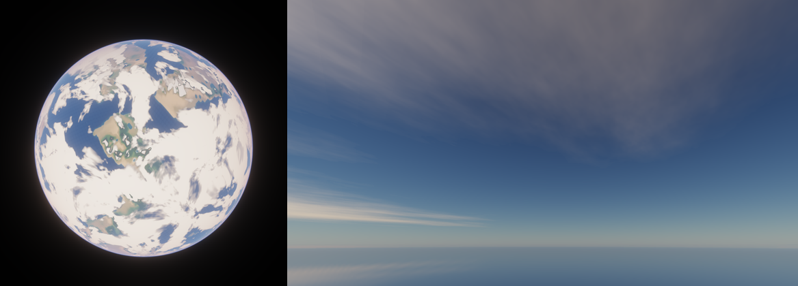

- A weather cloud layer where the climate rains: the equatorial belt and the
  storm tracks cloudy, the subtropical deserts clear, the planet averaging
  its observed cover (Earth ~55-65%); domain-warped fractal noise per pixel
  shapes the clouds from continent-sized systems down to tens of meters,
  drifting slowly with the winds
- Drawn inside the atmosphere pass: air in front of the clouds, the clouds,
  and the sky behind their gaps; bright tops from above, dark bases from
  below (two-stream light through thick cloud), reddened at sunset, glowing
  at thin edges toward the sun
- Clouds shadow the ground, and overcast skies dim the ambient light
- Per body: Earth's water clouds, Mars's rare thin water-ice clouds, Titan's
  methane clouds; Venus's sulfuric acid deck hides its surface completely

**Atmosphere**

| Sunset from 12 km | From orbit |
| --- | --- |
| 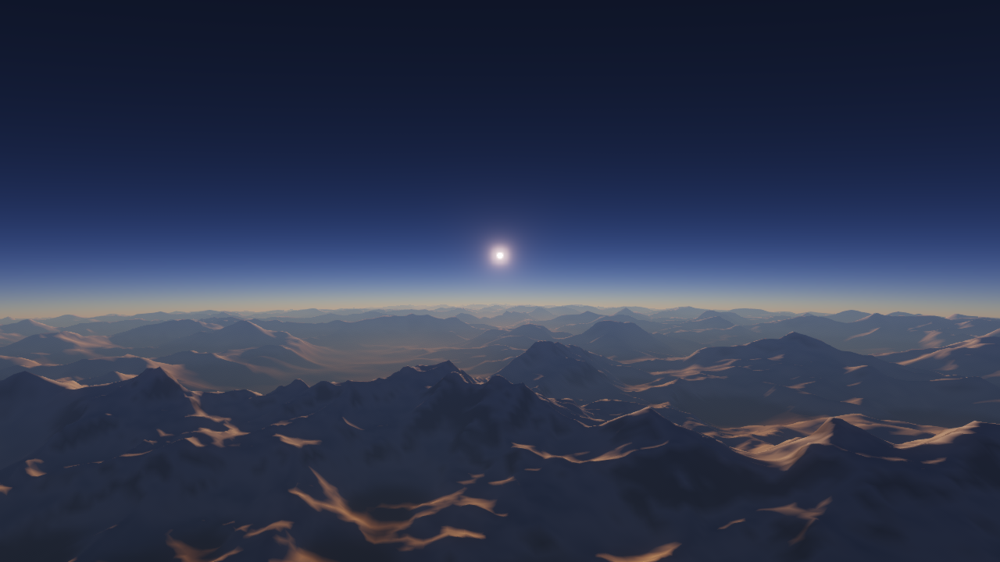 | 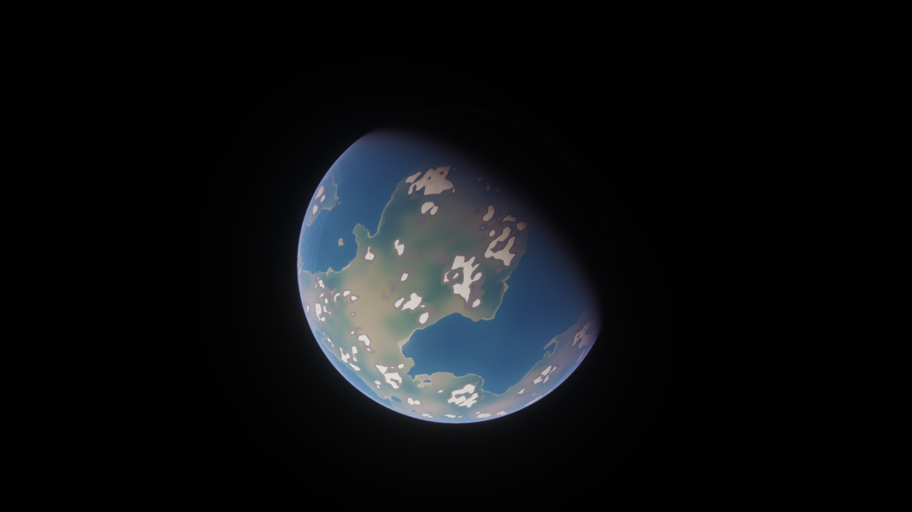 |

- Rayleigh, Mie and ozone scattering with multiple scattering (Hillaire 2020):
  transmittance and multiple-scattering lookup tables, then a raymarch per pixel
- Blue sky, sunsets, haze over distant terrain, and the planet's limb seen from
  space, from the same model and Earth's physical constants (all editable)
- Sunlight reaching every surface is filtered by the air above it: low sun
  turns orange, the night side goes dark
- Aerosols near the ground (dust, haze) or in a deck at altitude (Venus's
  sulfuric acid clouds at ~57 km, with clearer air below)
- Colored aerosols (per-channel scattering and absorption): Mars's
  butterscotch dust, Titan's orange haze
- Optically thick atmospheres (Venus's clouds, Titan's haze) pass diffuse
  daylight down to the ground (a two-stream estimate baked into a third lookup
  table), so their surfaces are dimly lit instead of black
- Ambient lighting and reflections baked from the atmosphere at the camera

**Rendering**

- Physically based shading (Cook-Torrance GGX, metallic-roughness as in glTF 2.0)
  with base color, metallic-roughness, normal, occlusion and emissive maps
- Directional, point and spot lights
- Cascaded shadow maps that follow the camera (stabilized against shimmering),
  plus spot light shadows, filtered with hardware PCF
- Procedural sky for scenes without a planet; ambient light and reflections baked from it
  (split-sum image-based lighting: irradiance, prefiltered specular, BRDF LUT)
- HDR pipeline: bloom, exposure with eye adaptation (dim scenes such as
  Titan's surface brighten, glaring ones darken, over half a second; views
  of a planet from space keep their exposure), ACES / Reinhard tone mapping,
  gamma correction, FXAA
- Close-up terrain detail: per-pixel fractal noise varies the ground's
  brightness and hue and adds micro-relief bump shading, fading out with
  distance so it never shimmers; bare worlds' regolith is mottled at every
  scale
- Batched drawing: one shared geometry buffer, one multi-draw-indirect call per
  material, frustum culling of every object and shadow caster
- Planet-scale precision: 64-bit world positions, camera-relative rendering and
  a reversed-Z infinite depth buffer
- OBJ and glTF / GLB model loading, including glTF materials and embedded textures
- Shader `#include`s and hot reload (edit a `.glsl` file while the engine runs)

**Editor**

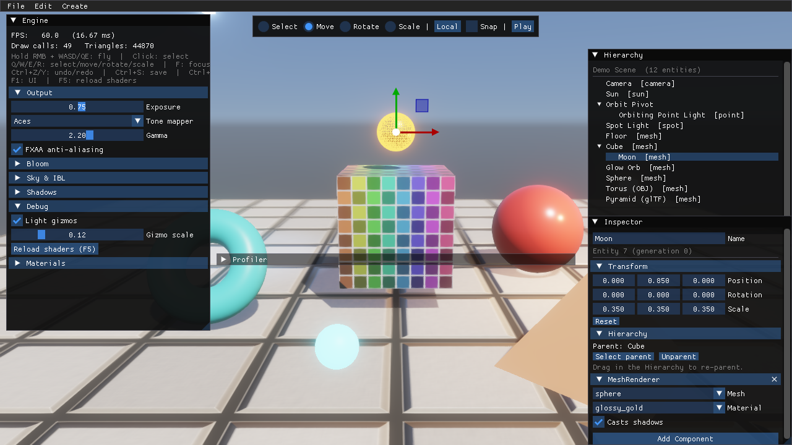

- Docked layout around the 3D viewport (drag panels to rearrange; View menu to
  show / hide them or reset the layout; Help > Controls lists every shortcut)
- **Planet panel**: jump to the surface / low orbit / whole-planet view, fly
  speed, local **time of day and season** (moves the sun; optional day cycle),
  terrain presets and sliders (the planet rebuilds when you release), seed,
  atmosphere density and haze, and **data views**: elevation with contour
  lines, slope, moisture, latitude, level of detail
- Viewport HUD: altitude above ground and sea level, speed, latitude /
  longitude, local time, frame rate
- Hierarchy with drag-and-drop parenting, inspector for every component
- Click-to-select in the viewport, move / rotate / scale gizmos with snapping
- Undo / redo (including planet and sun edits), scene files (JSON) with native
  open / save dialogs, model import
- Play / Stop: run the simulation, then restore the scene exactly
- Render settings, material editing, stats and a frame profiler (CPU + GPU
  timings) in the bottom panel

**Engine**

- Entity-component-system with parent / child transforms (quaternion rotations)
- Background job system: worker threads, results handed back to the main thread
  under a per-frame time budget
- Fixed-timestep simulation, uniform buffers for per-frame data, OpenGL debug
  output routed to the log
- 522 unit tests for everything that does not need a GPU

## Getting Started

### Requirements

- A GPU and driver supporting **OpenGL 4.5** (any desktop GPU from the last
  decade; developed on Intel Iris Xe)
- **Python 3.14** (the version the project is developed and tested with)
- Developed and tested on Windows. Linux should work but is untested; macOS is
  not supported (Apple's OpenGL stops at 4.1).

### Install

```bash
python -m pip install -r requirements.txt
```

On Windows with several Python versions installed, use the launcher:

```bash
py -3.14 -m pip install -r requirements.txt
```

### Run

```bash
python main.py
```

This opens `assets/scenes/planet.scene.json` if it exists, otherwise the
built-in demo: a procedural planet with an atmosphere, the camera above a
mountain valley.
The planet streams in over the first few seconds.

| Option | Meaning |
| --- | --- |
| `--scene PATH` | Open a different scene file |
| `--play` | Start with the simulation running |
| `--hide-ui` | Start with the editor and debug UI hidden (**F1** toggles) |
| `--no-vsync` | Uncapped frame rate (for measuring performance) |
| `--cprofile N` | Record a Python profile of the first N frames into `logs/profiles/` |
| `--exit-after S` | Quit after S seconds (smoke tests) |
| `--screenshot PATH` | With `--exit-after`, save the last frame as an image |

## Controls

| Input | Action |
| --- | --- |
| Hold right mouse button | Look around; **W A S D** move, **Space** up, **Shift** down. On a planet, W A S D move along the ground (around the planet when in orbit) and Space / Shift move straight away from / toward it; speed grows with altitude |
| Left click | Select an object |
| **Q / W / E / R** | Select / move / rotate / scale tool |
| **F** | Focus the camera on the selection (a planet: fit the whole planet in view) |
| **Delete**, **Ctrl+D** | Delete / duplicate the selection |
| **Ctrl+Z**, **Ctrl+Y** | Undo / redo |
| **Ctrl+S**, **Ctrl+O** | Save / open a scene |
| **Ctrl+P** | Play / stop |
| **Esc** | Clear the selection |
| **F1** | Show / hide the UI |
| **F5** | Reload all shaders |

## Project Layout

| Path | Contents |
| --- | --- |
| `main.py`, `application.py` | Entry point, main loop, demo content |
| `core/` | Window, input, events, timer, logging, profiler, job system |
| `ecs/` | Entity registry and components |
| `systems/` | Transform, camera controller, rotator, tectonics, climate, planet streaming and render systems |
| `planet/` | Body profiles, phases of volatiles, noise, cube-sphere mapping and simulation grid, plate tectonics and other tectonic regimes, impact craters, volcanoes, rivers and dunes, climate, terrain, chunk building, level of detail, solar time |
| `graphics/` | Renderer, shaders, textures, meshes, shadows, IBL, atmosphere, bloom |
| `editor/` | Scene editor, hierarchy / inspector / planet panels, picking, undo history |
| `scene/` | Scene container and scene file (de)serialization |
| `resources/` | Handle-based resource managers |
| `math3d/` | Transforms, camera, matrix helpers |
| `ui/` | ImGui integration, docked layout and panel registry, render / stats / profiler panels |
| `assets/` | Shaders, textures, scenes, body profiles (`bodies/`) |
| `tools/` | Asset generator and micro-benchmarks |
| `tests/` | pytest suite (`tests/fixtures/` holds the OBJ / glTF test models) |

## Development

Run the tests (no GPU needed):

```bash
python -m pytest
```

Regenerate the procedural textures in `assets/` and the test models:

```bash
python tools/generate_assets.py
```

Benchmark the per-frame hot paths:

```bash
python tools/benchmark_hot_paths.py
```

Shaders live in `assets/shaders/` and reload automatically when saved. The
Profiler window (bottom of the screen) shows CPU and GPU time per render pass;
untick VSync there to see the real cost of a frame.

## License

Released into the public domain under the [Unlicense](UNLICENSE).
Dependencies (installed through `requirements.txt`) keep their own licenses.
